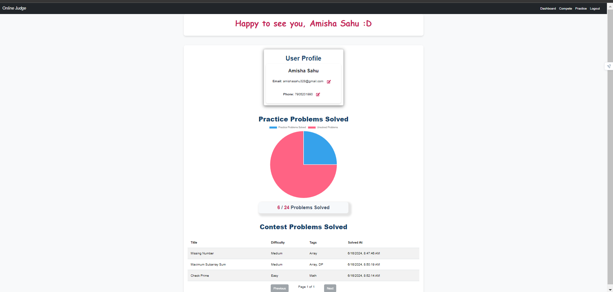
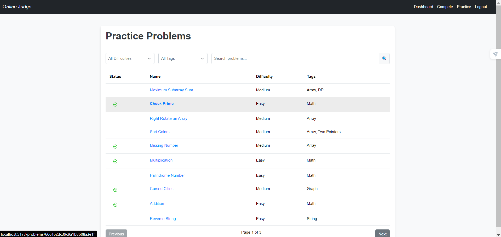
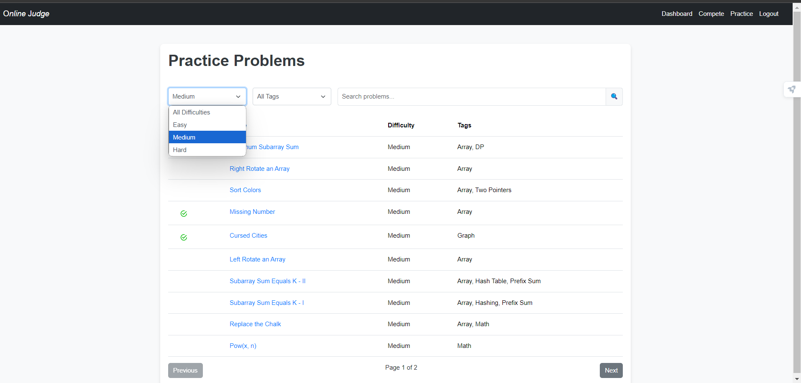
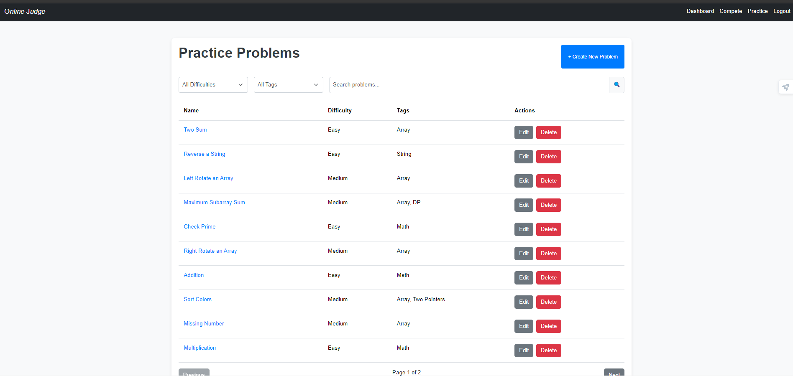
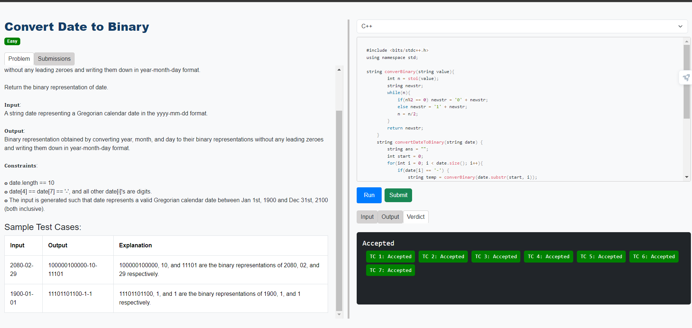
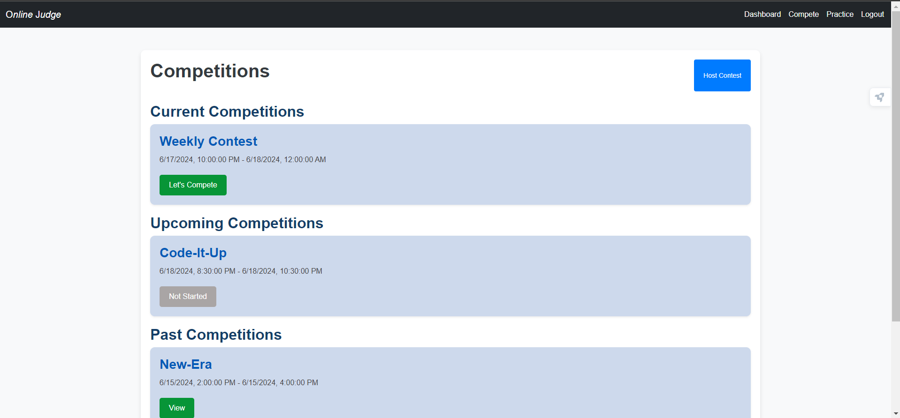
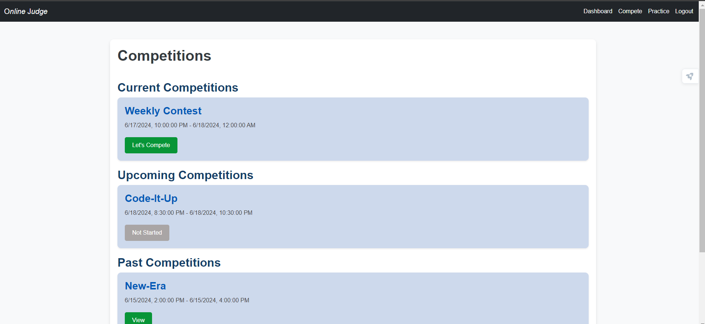

<h2 align ="center">Online Judge</h2>
An Online Judge system that allows users to solve coding problems, submit solutions, and receive feedback on their submissions. The platform supports multiple programming languages and provides features like user authentication, authorization, code execution, problem management, and contest hosting.<br/><br/>

- [Inspiration Behind the Project:](#inspiration-behind-the-project)
- [Target Goal:](#target-goal)
- [Features:](#features)
    - [1. USER AUTHENTICATION:](#1-user-authentication)
    - [2. FORGET PASSWORD:](#2-forget-password)
    - [3. AUTHORIZATION:](#3-authorization)
    - [4. PROBLEM LIST PAGE:](#4-problem-list-page)
    - [5. CODE EXECUTION AND SUBMISSION:](#5-code-execution-and-submission)
    - [6. CLEANUP SCHEDULER:](#6-cleanup-scheduler)
    - [7. CONTEST:](#7-contest)

<h2>ScreenShots</h2>

### 1. Landing Page

<table>
        <tr> 
        <td></td>
        </tr>
</table>

### 2. Registration/Login Page and Dashboard:

<table>
        <tr> 
        <td></td>
        <td></td>
        <td></td>
        </tr>
</table>

### 3. Forget Password:

<table>
        <tr> 
        <td></td>
        <td></td>
        <td></td>
        </tr>
</table>


### 4. Problem List Page with filter based on tags and difficulty:

<table>
        <tr> 
        <td></td>
        <td></td>
        </tr>
</table>

### 5. Admin's Problem List Page to perform CRUD operations:

<table>
        <tr> 
        <td></td>
        <td></td>
        <td></td>
        </tr>
</table>

### 6. Problems Page to read, run, and submit problems:

<table>
        <tr> 
        <td></td>
        <td></td>
        </tr>
</table>

### 7. Competition Page for Admin:

<table>
        <tr>
        <td></td>
        <td></td>
        </tr>
</table>

### 8. Competition Page for User:

<table>
        <tr> 
        <td></td>
        <td></td>
        <td></td>
        </tr>
</table>


## Inspiration Behind the Project:
The inspiration for this project came from the desire to create an interactive platform where programmers of all levels can practice and improve their coding skills. Inspired by popular competitive programming platforms like Codeforces, LeetCode, and HackerRank, this project aims to provide a comprehensive and user-friendly environment for learning, practicing, and competing in coding challenges.

## Target Goal:
The primary goal of this project is to create a robust, scalable, and user-friendly online judge system that caters to the needs of both learners and experienced programmers. The platform is designed to:

* **Enhance Coding Skills:** Provide a wide range of problems that help users improve their problem-solving and coding skills.
* **Facilitate Learning:** Offer features like sample test cases and detailed feedback to help users understand and learn from their mistakes.
* **Support Multiple Languages:** Enable users to write and test their code in various programming languages including C++, Java, C, and Python.
* **Provide Secure and Reliable Execution:** Ensure that user code is executed in a secure, controlled, and reliable environment with proper handling of different execution scenarios like runtime errors and time limit exceeded (TLE) conditions.
  
## Features:

#### 1. USER AUTHENTICATION:
- [x] Secure user login and session management using `JSON Web Tokens (JWT) and Cookie-based Authentication.`
- [x] Ensures that all forms are properly validated on the client and server sides.

#### 2. FORGET PASSWORD:
- [x]  Allows users to reset their passwords via email using the `Nodemailer` library.
  
#### 3. AUTHORIZATION: 
- [x] Only admin users can create, update, and delete problems, as well as host contests.

#### 4. PROBLEM LIST PAGE:
- [x] Lists all available problems. Users can select a problem to view details, run code, and submit solutions.
- [x] Users can submit solutions in C++, Java, C, or Python.

#### 5. CODE EXECUTION AND SUBMISSION:
- [x] Isolates the execution environment of the submitted code, ensuring secure and consistent execution without affecting the host system using `Docker`.
- [x] Executes submitted code against sample and hidden test cases.
- [x] Provides immediate feedback on submissions (e.g., Accepted, Wrong Answer, Runtime Error, Time Limit Exceeded).
- [x] Dependencies: `uuid, fs, path, child_process`
       
#### 6. CLEANUP SCHEDULER
- [x] Clears input, code, and output files created during execution every three hours to keep the application light using `node-cron` dependency.

#### 7. CONTEST:
- [x] Users can participate in ongoing contests and view the leaderboard at the end of the contest.

## Technologies Used:

### Backend:
* Node.js: JavaScript runtime for server-side development.
* Express.js: Web framework for building the backend APIs.
* MongoDB: NoSQL database for storing user data, problems, and contest information.
* Mongoose: ODM library for MongoDB.
* Docker: Used to run submitted code in isolated containers.
* UUID: For generating unique identifiers.
* fs, path: File system and path manipulation.
* child_process: Node.js module for executing system commands.
* Nodemailer: For sending password reset emails.

### Frontend:
* React: JavaScript library for building user interfaces.
* React Router (react-router-dom): Library for handling client-side routing.
* Axios: Promise-based HTTP client for making API requests.
* Hooks: Used for managing state and side-effects
* Props: For passing data between components
* State: For managing component state
* react-simple-code-editor: For building the code editor interface

## Setting up project:

1. Fork this project by clicking the Fork button on top right corner of this page.
2. Clone the repository by running following command in git:
```
git clone https://github.com/yourusername/online-judge.git
```
3. Go into the backend folder and install dependency:
```
cd "Online-Judge\backend"
npm install
```

4. Go to the compiler folder and install dependency:
```
cd "Online-Judge\compiler"
npm install
```
5.  Go to the frontend folder and install dependency:

```
cd "Online-Judge\frontend"
npm install
```

### Running the Project:

Start the backend server:
```
nodemon App.js
```

Start the compiler server:
```
nodemon App.js
```

Start the frontend server
```
npm run dev
```

